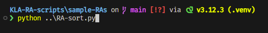
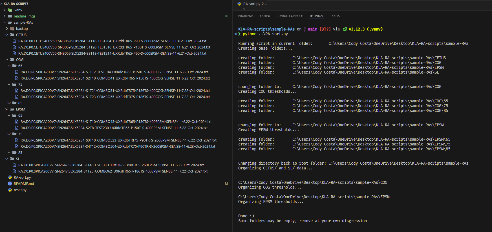
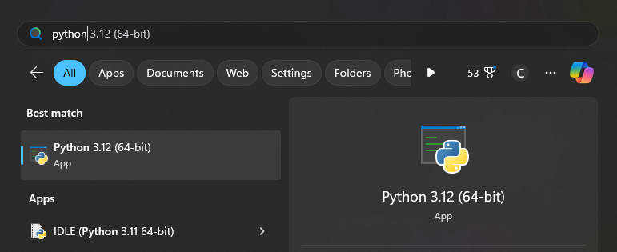
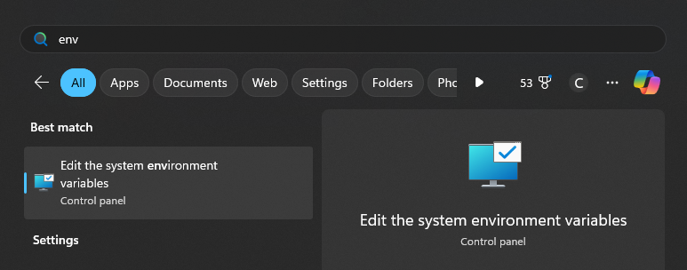
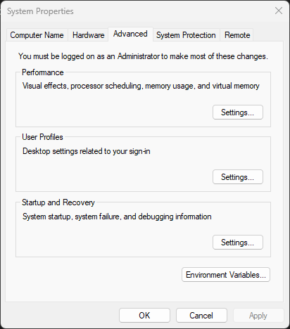
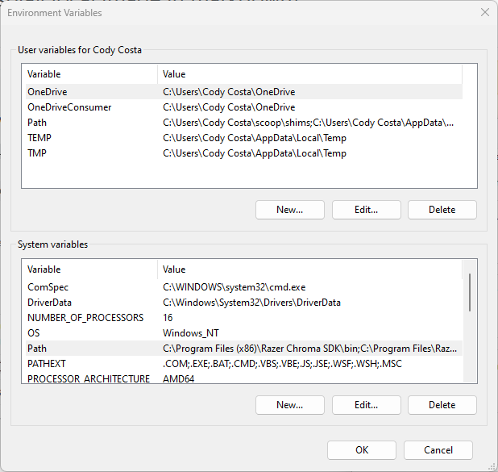
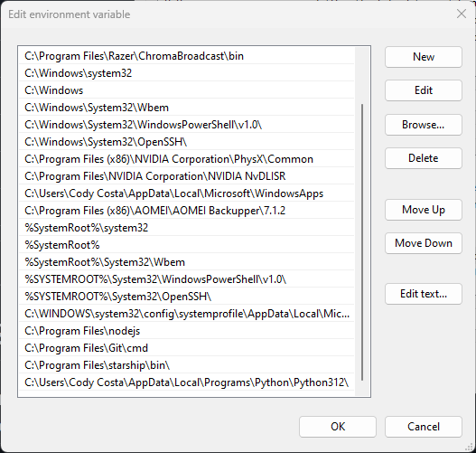

# 5XX RA Sort Python script

### Turn a cluttered directory into a well organized file storage, ready for excel!
 

## !! Please read if you are new to using python or need assistance with setting up your machine !!

### Setup should not take more than 20 minutes and is a one time deal, after that there's no other prerequisites to begin use

 
 

# Usage

### 1:
Navigate to a folder where you have some RA files located\
For example let's say they exist in the following folder:\

> cd ~/Documents/5XX/52XX/SV_RA

### 2:

Run RA-sort.py:
After downloading RA-sort.py from github here, I'd recommend keeping it (or a copy) close to, or even inside, the RA directory you intend to sort.\
This way, typing out the file path is not a hassle

> ~/Documents/5XX/52XX/SV_RA >> python [path to RA-sort.py]

 

### Example
In the below photos you can see I have some RA files stored in:
#### ~/sample-RAs
and my copy of RA-sort.py stored in the previous folder:
#### ~/

This makes calling the file easy, as all I have to do is navigate to my RA folder and retreat by one folder to execute the script, rather than trying to remember the path to downloads or documents:\

 
 

Before\

 
 

After\
Uutput on left, terminal activity on right\

 
 
 

# How To Download RA-sort.py
At the top of the page if you are reading this, click on RA-sort.py\

 

Next, on the top right of the file page, click the button to download raw file\

 
 
 

# Priming Your Machine For Python
## Step 1: Make sure you have python installed (version 3.7 or later)
Python can be downloaded from https://www.python.org/. I would recommend installing the latest version if you are unsure.\
To check if your machine already has a version of python installed, simply press the windows key and search for 'python':\

 
 
If you do not see a version installed, follow the instructions on Python's website linked above for a fresh install. After downloading, be sure to run the .exe file to install it.

 

## Step 2: Adding Python to your system path
This step will take the most work, but is not difficult to do.\
First, keep your path to python handy, we will need it later.\
 

You can find this located at: 
### C:\Users\USER\AppData\Local\Programs\Python\Python312\
Just enter your USER name and substitute Python312 with whichever version you downloaded.\
Python 3.13 is the latest release at the time of development.\
 

Next, press the windows key and type out 'env', and click on **Edit the system environment variables**

 
 

A new 'System Properties' window will open, and we want to click on **Environment Variables**\

 
 

This will bring up a new window called 'Environment Variables'\
Navigate to the **system variables** section and click on the item labeled Path and then click **Edit**

 
 

Another new window will pop up, and we will then click on **New**\
In the field that pops up, here is where you will paste in your PYTHON PATH from earlier\
You can see mine listed at the bottom\

 

#### Go ahead and click on **OK** on all the open windows to close them, and you are done with path setup!

 

## Step 3:  Diasabling Execution Aliasing
This part is easier than step 2.\
Press the windows key and search for 'app exec', and click on **Manage app execution aliases**

 
 

Scroll down until you see 2 programs named **App Installer** with python.exe and python3.exe listed below the titles.\
Turn both of these **OFF**\

 
 

# Setup is finished, you can now return to the top to read on the usage of the file!
