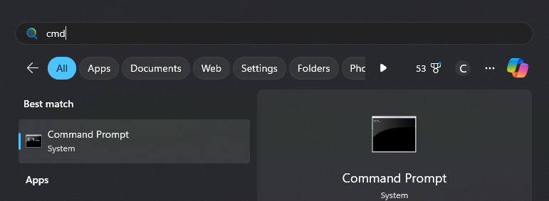
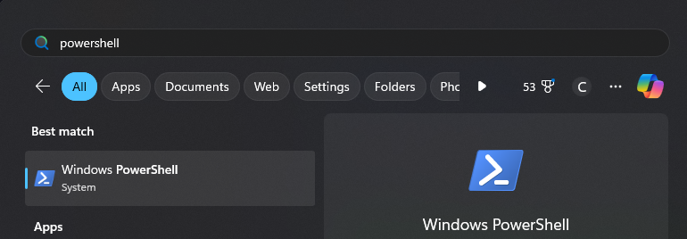
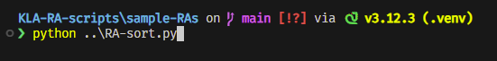
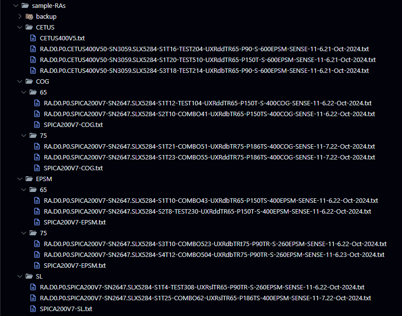
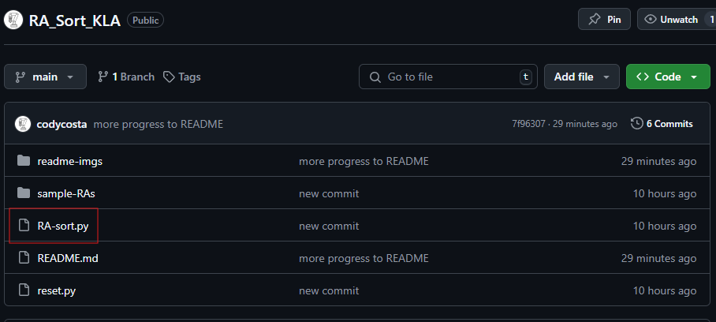
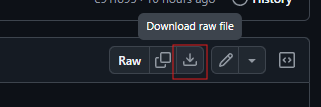
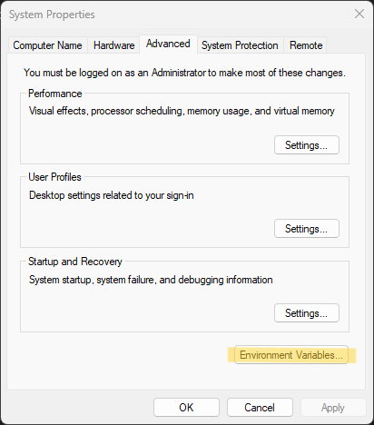
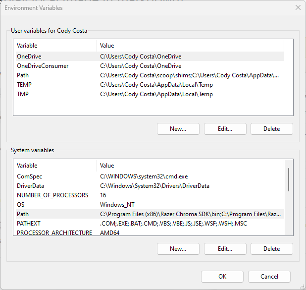
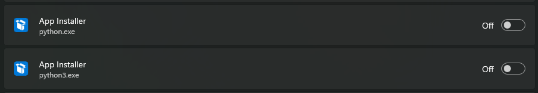

# 5XX RA Sort Python script

>[!IMPORTANT]
> All RA.txt files and the like are blank mock-ups used for demonstrating the usage and performance of the product. No company data was used in the making of this tool.

### Turn a cluttered directory into a well organized file storage, ready for excel!

>[!NOTE]
>Please read if you are new to using python or need assistance with setting up your machine.

#### Setup should not take more than 20 minutes and is a one time deal, after that there's no other prerequisites to begin use. I've tried to make this guide as easy and beginner friendly as possible.

>[!NOTE]
>RA-sort.py will automatically create a backup folder to dump a copy of all RA files into before sorting. This way if something were to go wrong during execution, or you as the user are unhappy with the results, there is a safe restore point to reset the folder to how it started.

<br>
<br>

# Usage

### Step 0: Launch a terminal environment
#### Any terminal you have installed will work (cmd, bash, powershell, etc...)

<br>

The default windows terminal on our KLA machines is Windows Command Prompt. To launch this just press the windows key and type 'cmd':\


<br>

To elevate your terminal game, I'd recommend using Powershell rather then Command Prompt, which can be easily found in the same fashion by searching for Powershell at the windows start menu:\


<br>

### Step 1: Navigate to RA folder
For example let's say we have some RA's that exist in the following folder:

```powershell
~/Documents/5XX/SV_RA/
```
<br>

### Step 2: Run RA-sort.py
Let's say we downloaded and moved RA-sort.py to the following folder. Continue to the next section for download instructions.

```powershell
~/Documents/5XX/RA-sort.py
```

>[!TIP]
>After downloading RA-sort.py from github here, I'd recommend keeping it (or a copy) close to, or even inside, the RA directory you intend to sort. This way, typing out the file path is not a hassle.

<br>

Your command line execution would look something like this:


```powershell
~/Documents/5XX/SV_RA/ >      [python | py] [path to RA-sort.py]


or with the example file/folder names:

~/Documents/5XX/SV_RA/ >      python ../RA-sort.py
```
>[!TIP]
>You can use either **python** or **py** prefixes to reference the python file. 

<br>

## Optional
### Step 3: Organize excel along with RA's

You can also elect to have the script copy and organize your excel workbooks along with the RA files.\
To do this, after calling RA-sort.py, add an extra argument that references the path to the blank workbook folder.\
Say we have our blank workbooks in the following folder:

```powershell
~/Documents/5XX/blank-workbooks/
```

To reference this folder we would run the following:

```powershell
~/Documents/5XX/SV_RA/ >     [python | py] [path to RA-sort.py] [path to blank workbooks]


or with the example file/folder names:

~/Documents/5XX/SV_RA/ >      python ../RA-sort.py ../blank-workbooks
```

>[!IMPORTANT]
>If you would like to do this, make sure that each of your blank excel workbooks at least has 'COG', 'EPSM', 'CETUS' and 'SL' in the name.
<br>

>[!TIP]
> Like with the RA-sort.py script, I recommend keeping your folder of blank excel workbooks nearby to easily access
<br>

When organizing the excel workbooks, RA-sort.py will count the number of RA P0 files in each folder and will duplicate the needed excel workbook should the quantity of unique RA files exceed 10. This way there are the required number of excel files within each base/threshold folder.
<br>
<br>

## Example
In the below photos you can see I have some RA files stored in:
```powershell
~/KLA-RA-scripts/sample-RAs/
```
<br>

and my copy of RA-sort.py stored in the previous folder:
```powershell
~/KLA-RA-scripts/RA-sort.py
```
<br>

Keeping RA-sort.py close to the RA folder makes execution easy.\
I just need to navigate to my RA folder (samlple-RAs) and call on RA-sort.py which is in the previous folder:


<br>
<br>

### Before

<br>
<br>

### After

<br>
<br>
<br>

# How To Download RA-sort.py
At the top of the page if you are reading this, click on RA-sort.py\

<br>

Next, on the top right of the file page, click the button to download raw file\

<br>

### That's it, your file will be in your downloads folder
<br>
<br>

# Priming Your Machine For Python
## Step 1: Make sure you have python installed (version 3.7 or later)
Python can be downloaded from https://www.python.org/. I would recommend installing the latest version if you are unsure.\
To check if your machine already has a version of python installed, simply press the windows key and search for 'python':\

<br>
<br>
If you do not see a version installed, follow the instructions on Python's website linked above for a fresh install. After downloading, be sure to run the .exe file to install it.

<br>

## Step 2: Adding Python to your system path
This step will take the most work, but is not difficult to do.\
First, keep your path to python handy, we will need it later.\
<br>

You can find this located at: 
```powershell
C:\Users\<USER>\AppData\Local\Programs\Python\Python312\
```

Just enter your USER name and substitute Python312 with whichever version you downloaded.\
Python 3.13 is the latest release at the time of development.\
<br>

Next, press the windows key and type out 'env', and click on **Edit the system environment variables**

<br>
<br>

A new 'System Properties' window will open, and we want to click on **Environment Variables**\

<br>
<br>

This will bring up a new window called 'Environment Variables'\
Navigate to the **system variables** section and click on the item labeled Path and then click **Edit**

<br>
<br>

Another new window will pop up, and we will then click on **New**\
In the field that pops up, here is where you will paste in your PYTHON PATH from earlier\
You can see mine listed at the bottom\

<br>

#### Go ahead and click on **OK** on all the open windows to close them, and you are done with path setup!

<br>

## Step 3:  Diasabling Execution Aliasing
This part is easier than step 2.\
Press the windows key and search for 'app exec', and click on **Manage app execution aliases**

<br>
<br>

Scroll down until you see 2 programs named **App Installer** with python.exe and python3.exe listed below the titles.\
Turn both of these **OFF**\

<br>
<br>


### Setup is finished, your computer is ready to run Python
### Navigate back to the top to read about the file Usage
