# 5XX RA Sort Python script
```py
$$$$$$$\   $$$$$$\                                         $$\                             
$$  __$$\ $$  __$$\                                        $$ |                            
$$ |  $$ |$$ /  $$ |         $$$$$$$\  $$$$$$\   $$$$$$\ $$$$$$\        $$$$$$\  $$\   $$\ 
$$$$$$$  |$$$$$$$$ |$$$$$$\ $$  _____|$$  __$$\ $$  __$$\\_$$  _|      $$  __$$\ $$ |  $$ |
$$  __$$< $$  __$$ |\______|\$$$$$$\  $$ /  $$ |$$ |  \__| $$ |        $$ /  $$ |$$ |  $$ |
$$ |  $$ |$$ |  $$ |         \____$$\ $$ |  $$ |$$ |       $$ |$$\     $$ |  $$ |$$ |  $$ |
$$ |  $$ |$$ |  $$ |        $$$$$$$  |\$$$$$$  |$$ |       \$$$$  |$$\ $$$$$$$  |\$$$$$$$ |
\__|  \__|\__|  \__|        \_______/  \______/ \__|        \____/ \__|$$  ____/  \____$$ |
                                                                       $$ |      $$\   $$ |
                                                                       $$ |      \$$$$$$  |
                                                                       \__|       \______/
```

# Quick Section Links

### [Script Usage](#usage)
### [PowerShell Shortcuts](#creating-a-profile-function-shortcut)
### [Download Options](#how-to-download-ra-sortpy)
### [Setting up Python](#getting-started-with-python)

<br>

<!-- >[!IMPORTANT]
> All RA.txt files and the like are blank mock-ups used for demonstrating the usage and performance of the product. No company data was published to this repository. -->

>[!IMPORTANT]
>Please read if you are new to using python, new to terminal scripting, or need assistance with setting up your machine.

>[!NOTE]
>RA-sort.py will automatically create a backup folder to dump a copy of all RA files into before sorting. This way if something were to go wrong during execution, or you as the user are unhappy with the results, there is a safe restore point to reset the folder to how it started.

### Turn a cluttered directory into a well organized file storage, ready for excel!

#### Setup should not take more than 20 minutes and is a one time deal, after that there's no other prerequisites to begin use. I've tried to make this guide as easy and beginner friendly as possible.

<br>
<br>
<br>

# Usage

## Step 0: Launch a Terminal
#### Any terminal you have installed will work (cmd, bash, powershell, etc...)

<br>

The default windows terminal on our KLA machines is Windows Command Prompt. To launch this just press the windows key and type 'cmd':\
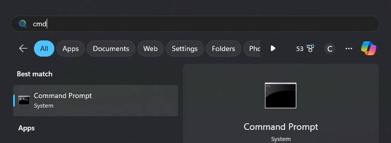

<br>

To elevate your terminal game, I'd recommend using Powershell rather then Command Prompt, which can be easily found in the same fashion by searching for Powershell at the windows start menu:\
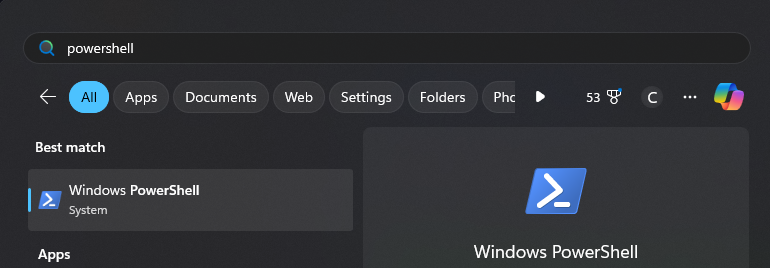

<br>

## Step 1: Navigate to RA folder
For example let's say we have some RA's that exist in the following folder:

```powershell
~/Documents/5XX/SV_RA/
```

<br>

## Step 2: Run RA-sort.py
Let's say we downloaded and moved RA-sort.py to the following folder. Continue to the next section for download instructions.

```powershell
~/Documents/5XX/RA-sort.py
```

>[!TIP]
>After downloading RA-sort.py from github here, I'd recommend keeping it (or a copy) close to, or even inside, the RA directory you intend to sort. This way, typing out the file path is not a hassle.

<br>

Your command line execution would look something like this:


```powershell
~/Documents/5XX/SV_RA/ >      [python | py] [path to RA-sort.py]


or with the example file/folder names:

~/Documents/5XX/SV_RA/ >      python ../RA-sort.py
```
>[!TIP]
>You can use either **python** or **py** prefixes to reference the python file. 

<br>

## Optional Step 3: Organize Excel files along with RA files

You can also elect to have the script copy and organize your excel workbooks along with the RA files.\
To do this, after calling RA-sort.py, add an extra argument that references the path to the blank workbook folder.\
Say we have our blank workbooks in the following folder:

```powershell
~/Documents/5XX/blank-workbooks/
```

To reference this folder we would run the following:

```powershell
~/Documents/5XX/SV_RA/ >     [python | py] [path to RA-sort.py] [path to blank workbooks]


or with the example file/folder names:

~/Documents/5XX/SV_RA/ >     python ../RA-sort.py ../blank-workbooks
```

>[!WARNING]
>If you would like to do this, make sure that each of your blank excel workbooks at least has 'COG', 'EPSM', 'CETUS' and 'SL' in the name.
<br>

>[!TIP]
> Like with the RA-sort.py script, I recommend keeping your folder of blank excel workbooks nearby to easily access
<br>

When organizing the excel workbooks, RA-sort.py will count the number of RA P0 files in each folder and will duplicate the needed excel workbook should the quantity of unique RA files exceed 10. This way there are the required number of excel files within each base/threshold folder.
<br>
<br>

## Example
During testing, I stored some mock RA files in the following folder:
```powershell
~/KLA-RA-scripts/sample-RAs/
```
<br>

My copy of RA-sort.py was stored in the previous folder:
```powershell
~/KLA-RA-scripts/RA-sort.py
```
<br>

And my blank excel workbooks in the following folder:
```powershell
~/KLA-RA-scripts/blank-workbooks/
```
<br>
<br>

### Executing RA-sort.py on my end would look like this:
```powershell
~/KLA-RA-scripts/sample-RAs/ >     py ../RA-sort.py ../blank-workbooks
```
easy peasy :)
<br>
<br>
<br>

<!-- ### Before
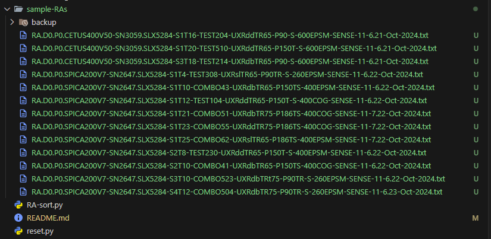
<br>
<br>

### After
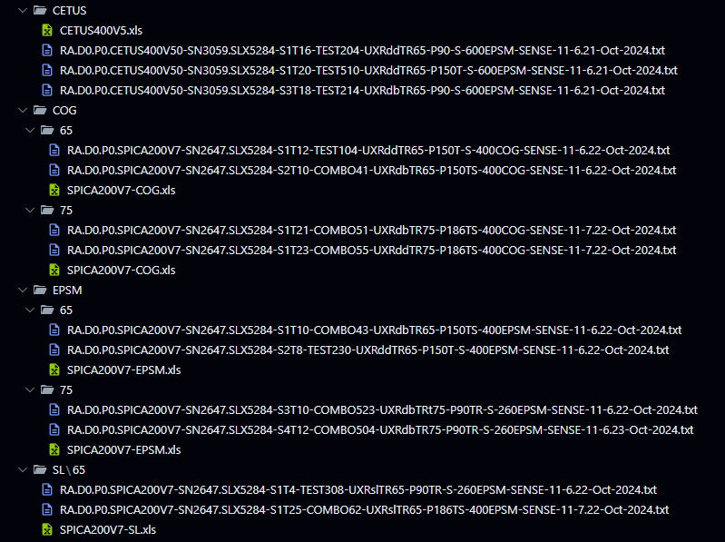
<br>
<br>
<br> -->

# Creating A Profile Function Shortcut
## Recommended for easy repeated use

If rerunning this script using the above command line arguments gets boring and repetitive, here's a shortcut to help you speed things up by assigning a powershell function to serve as an alias for the command:

## Step 0: Launch a Terminal
You know how to do this already...(launch PowerShell)

<br>

## Step 1: Set Your Windows Execution Policy
to do this just run the following in any folder in the terminal:

```powershell
Set-ExecutionPolicy -Scope CurrentUser -ExecutionPolicy RemoteSigned
```

<br>

## Step 2: Create A Powershell Function
This is easy to do. Open your $profile script by running the following in any folder:

```powershell
notepad $profile
```
this should launch the profile script in none other than the windows notepad app

<br>

Here's the basic template. Type this out in your notepad $profile window.

```powershell
function [some function name] { 
    [python | py] [your path to RA-sort.py] [your path to blank excel workbooks] 
}
```

#### Be sure to include the entire file and folder path for both RA-sort.py and the blank workbook folders. Using the above example files/folders here's what my function would look like:

```powershell
function pysort {
    py 'C:\Users\Cody\KLA_RA_scripts\RA-sort.py' 'C:\Users\Cody\KLA_RA_scripts\blank-workbooks'
}
```

>[!IMPORTANT]
> - Remember to update this script if you download a new version release of RA-sort or move your files to different locations
> - Notice how my file and folder paths are wrapped in **quotes** ('' or "", doesn't matter).\
> -- This is necessary when your file or folder names have spaces (' ') in them, but is good practice to do anyway just in case.
> - Do not end folder names with a slash '\\' or '/'. Listing it as ~/blank-workbooks/ will crash RA-sort.py as the OS cannot interpret the folder name and you'll receive a partial completion

<br>

Great! Now we have a function to call RA-sort.py without having to pass any command arguments to the terminal when running. The next time you go to run the script on a data set, all you'll need to do is call the function name:

```powershell
~/KLA-RA-scripts/sample-RAs/ >     pysort
```

You can go ahead and save and close your notepad file now!
You'll need to relaunch the terminal for changes to take effect.

>[!WARNING]
> I would recommend testing the script first and seeing some success before assigning an alias function.\
> This ensures your spelling is correct and you have verified the files and folders arguments passed to the function are acceptable.

<br>

<!-- ### Step 3: Set Your Windows Execution Policy

Copy the below command and run in any folder to allow your terminal to load the $profile file we just made each time it opens:

```powershell
Set-ExecutionPolicy -Scope CurrentUser -ExecutionPolicy RemoteSigned
``` -->

You'll need to relaunch the terminal for changes to take effect

### And that's all, your terminal should be ready for shortcutting

<br>
<br>
<br>

# How To Download RA-sort.py
## Stable Releases (Recommended)
>[!IMPORTANT]
>To get the latest and greatest version of the file I would recommend downloading the zip file from the Releases tab near the top of the page

## Step 1. Click on releases (or the version with the attached 'Latest' tag)

<br>

## Step 2. Click on either **Source code** button to download your preferred file format, both are essentially zip files
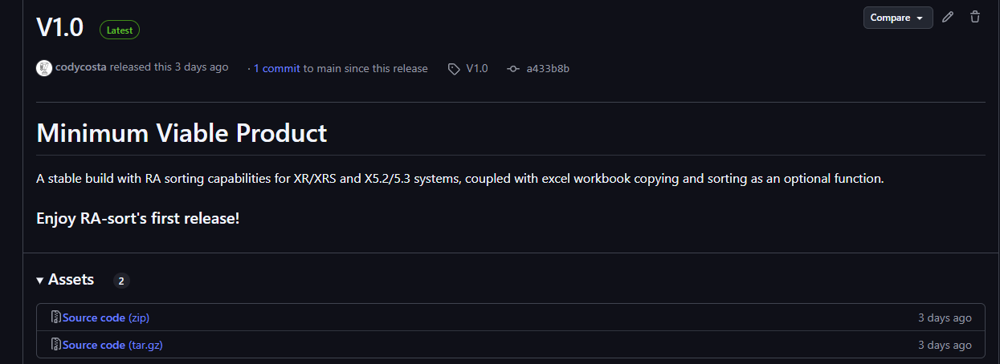
<br>

### This will drop a zip file of all of the repository's contents into your downloads folder. From here you can pick out RA-sort.py
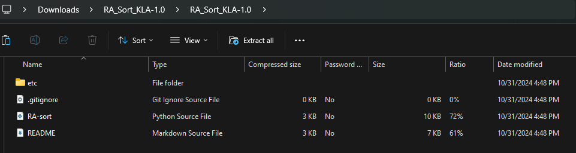

<br>
<br>

## Experimental Pre-releases
>[!WARNING]
>RA-sort.py may not perform as intended with pre-release versions

## Step 1. At the top of the page if you are reading this, click on RA-sort.py

<br>

## Step 2. Next, on the top right of the file page, click the button to download raw file
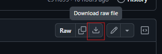
<br>


### That's it, your file will be in your downloads folder

<br>
<br>
<br>

# Getting Started With Python
## Step 1: Make sure you have python installed (version 3.7 or later)
Python can be downloaded from https://www.python.org/. I would recommend installing the latest version if you are unsure.\
To check if your machine already has a version of python installed, simply press the windows key and search for 'python':\
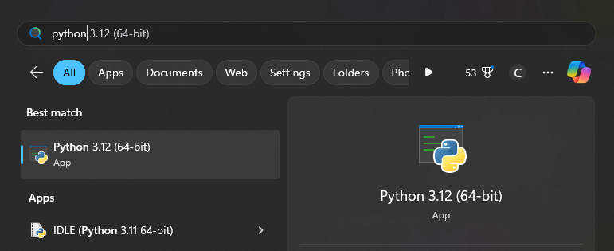
<br>
<br>
If you do not see a version installed, follow the instructions on Python's website linked above for a fresh install. After downloading, be sure to run the .exe file to install it.

>[!NOTE]
> During installation, the program will ask you if you would like to add Python to the system path, check this box if you see it to avoid needing to do Step 2.\
> Step 3 is recommended to do anyway

<br>

## Step 2: Verify Python is on Your System Path
This step will take the most work, but is not difficult to do
<!-- First, keep your path to python handy, we will need it later.\ -->

An easy check do check if python's executable file is found on your path is to run the following in any folder in the terminal:
```powershell
> gcm python

output:

CommandType     Name             Version    Source
-----------     ----             -------    ------
Application     python.exe       3.12.31... C:\Users\Cody Costa\AppData\Local\Programs\Python\Python312\python.exe

```

If you don't see a similar result with a source similar to the following then proceed with the rest of the guide: 
```powershell
C:\Users\<USER>\AppData\Local\Programs\Python\Python<3XX>\
```

<br>

Press the windows key and type out 'env', and click on **Edit the system environment variables**
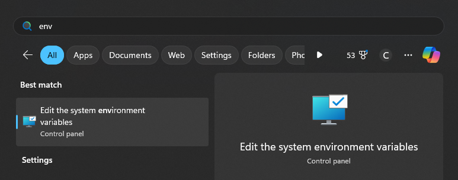
<br>
<br>

A new 'System Properties' window will open, and we want to click on **Environment Variables**\
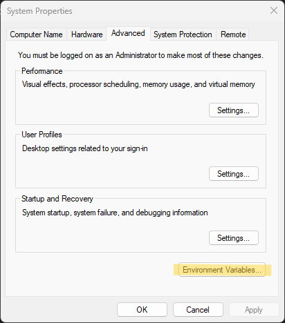
<br>
<br>

This will bring up a new window called 'Environment Variables'\
Navigate to the **system variables** section and click on the item labeled Path and then click **Edit**
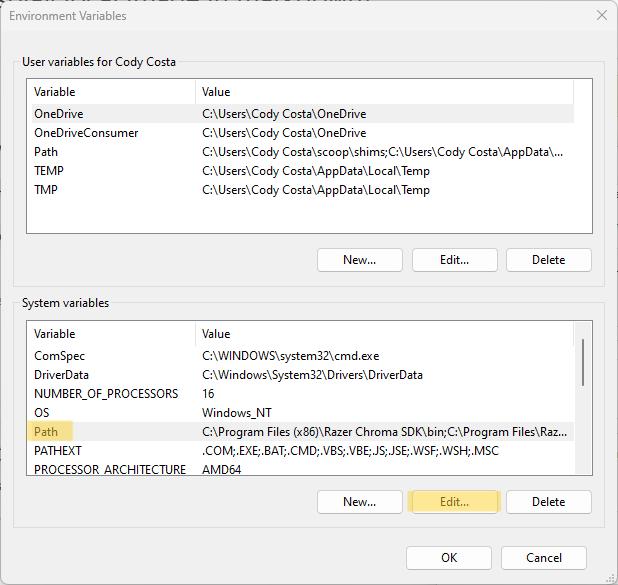
<br>
<br>

Another new window will pop up, and we will then click on **New**\
In the field that pops up, here is where you will paste in your PYTHON PATH from earlier\
You can see mine listed at the bottom\
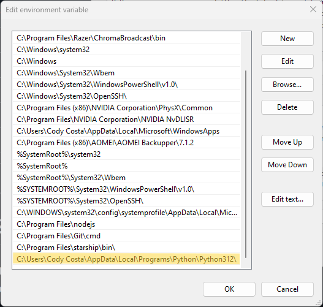
<br>

#### Go ahead and click on **OK** on all the open windows to close them, and you are done with path setup!

<br>

## Step 3:  Diasabling Execution Aliasing
This part is easier than step 2.\
Press the windows key and search for 'app exec', and click on **Manage app execution aliases**
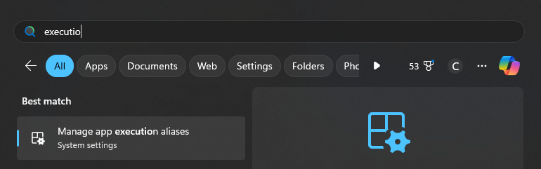
<br>
<br>

Scroll down until you see 2 programs named **App Installer** with python.exe and python3.exe listed below the titles.\
Turn both of these **OFF**\

<br>
<br>


### Setup is finished, your computer is ready to run Python
### Navigate back to the top to read about the file Usage
